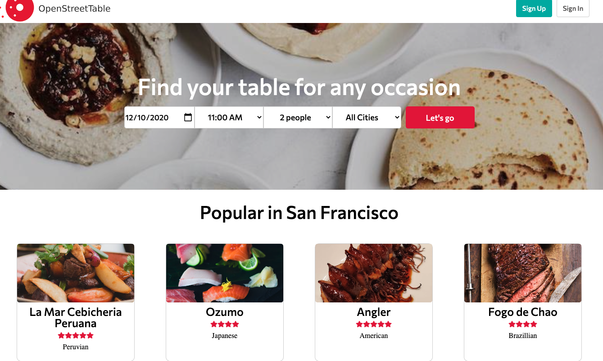
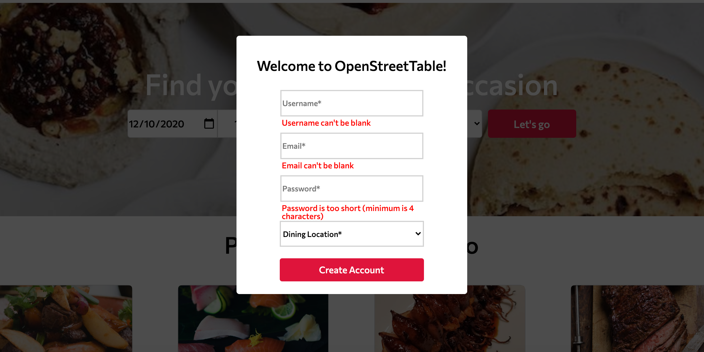
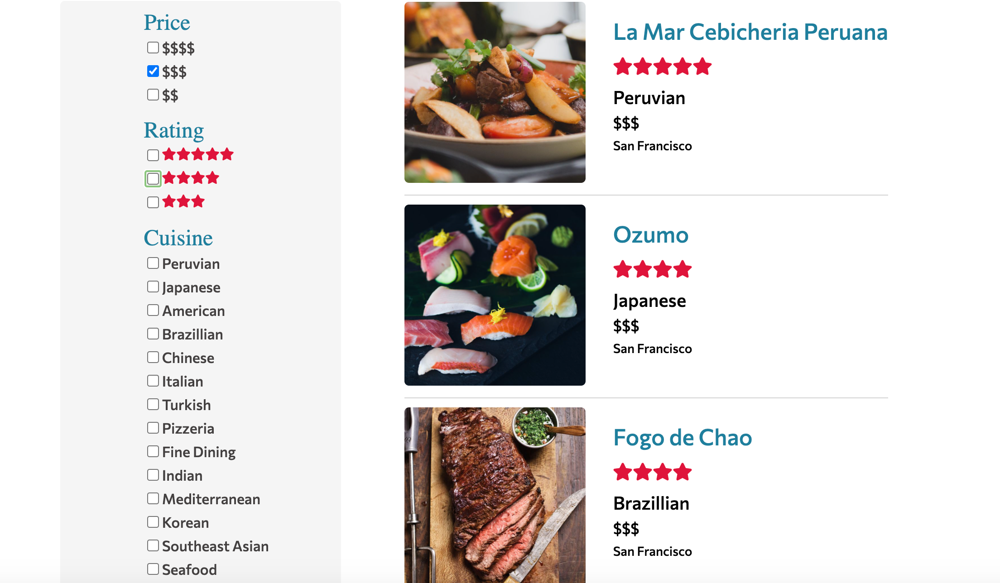
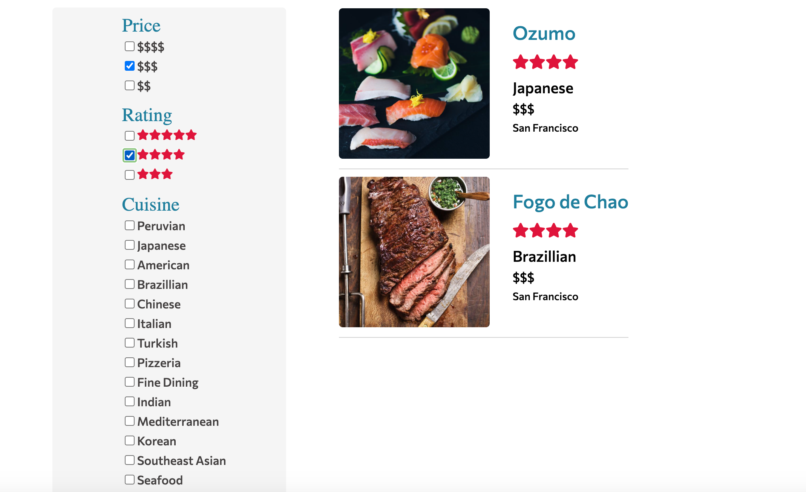
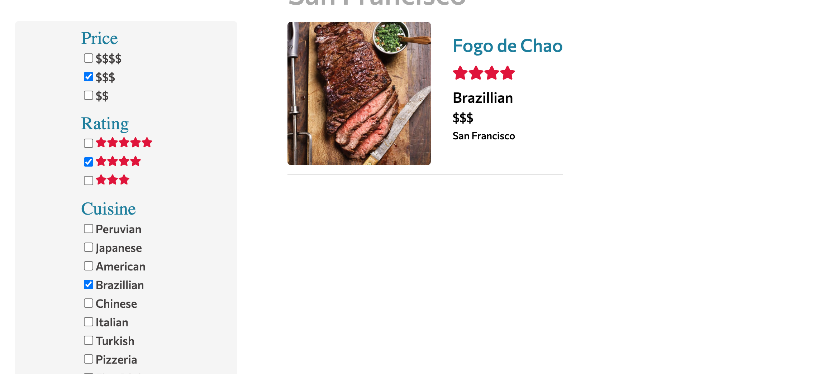
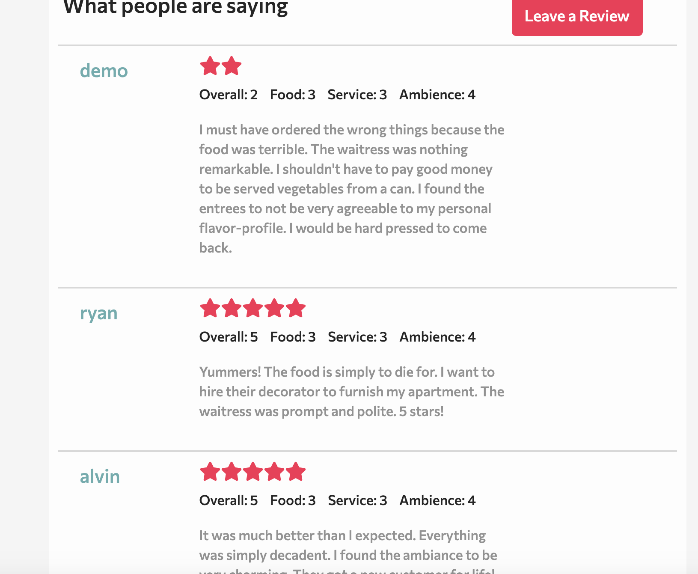
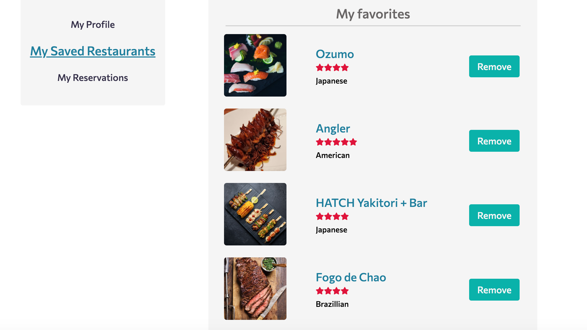
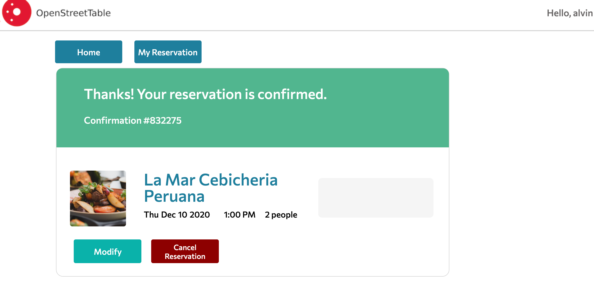
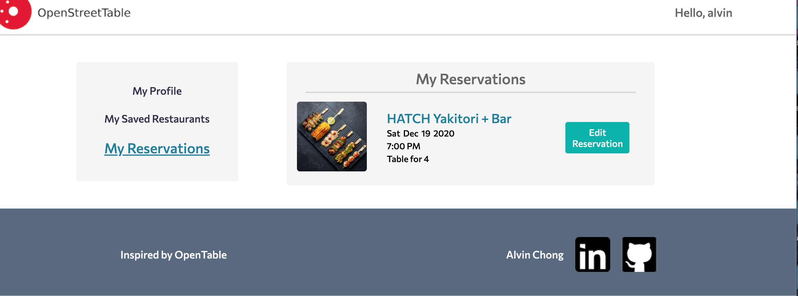

# [OpenStreetTable](https://fullsteakproject.herokuapp.com/#/)


## Description

OpenStreetTable is a clone of OpenTable where users can make and change reservations, read reviews and look up amazing food photos from many different cities. OpenStreetTable is built using Ruby on Rails and React Redux.  



## Technologies 
* Ruby on Rails - Backend server 
* React-Redux - frontend rendering
* Postgresql - database
* HTML/SCSS - styling 

## Installation
### Pre-requisites
PostgreSQL Database is required for OpenStreetTable to operate correctly

### Setting Up
Please run the following commands:

```
bundle install
npm install
bundle exec rails db:create
bundle exec rails db:migrate
bundle exec rails db:seed
```

### Running the app
please run the following commands in separate terminals:

```
rails server
npm run webpack
```


## Features 
### 1. User Authentication
   * Users can Sign Up, Sign in and Sign Out
   * Users can use a demo login to test the site
   * Users can't use certain features without logging in( e.g. making reservation & rating restaurants)
   
   
   
### 2. Restaurants and Search 
   * Users can look up restaurants on the splash page or by clicking a city of their choice.
   * In the City show page, Users have acess to sidebar filter to narrow down the search choices.
   
   ```
     this.state = { checkedCuisineIds: {}, checkedPriceIds: {}, checkedRatingIds: {}, }
     const cuisineValuesBooleanArr = Object.values(this.state.checkedCuisineIds);
     const cuisine = restaurant.cuisine;
     const priceId = restaurant.price;
     const cuisineId = cuisineIds[cuisine];
     const allCuisineFalse = cuisineValuesBooleanArr.every((bool) => bool === false);
     if ( (city.id === restaurant.city_id) && (checkedPriceIds[priceId] && checkedRatingIds[ratingId] ) && ( allCuisineFalse ) )
   ```
   
   
   
   
   
### 3. Ratings/Reviews
   * Signed in Users can leave a review, update and delete own reviews.
   * Users and non-users can view all reviews on the restaurant show page.
   
   
   
   
### 4. Favorites
   * Signed in Users can "favorite"/bookmark restaurants of their choices.
   * Users can view lists of favorites at their bio page.
   
   
   
### 5. Reservations
   * Signed in users are allowed to make, cancel and update reservations
   * Users can view lists of upcoming reservations at their bio page.
   * Require Signed in when making reservations
   
   ```
     handleLoaded() {
        const findTableBtn = document.getElementsByClassName("sticky-button")[0];
        const loader = document.getElementById("sticky-loader");
        if (this.props.currentUser) {
            findTableBtn.style.display = "none";
            loader.style.display = "block"
            setTimeout(this.handleFindTable, 1400);
        } else {
            this.props.openModal('login');
        }
      }
   ```
   
   
   
   
## Upcoming Features 
* Icons! 
* Incorporating Google Maps API 
* Building a Carousel for viewing images
